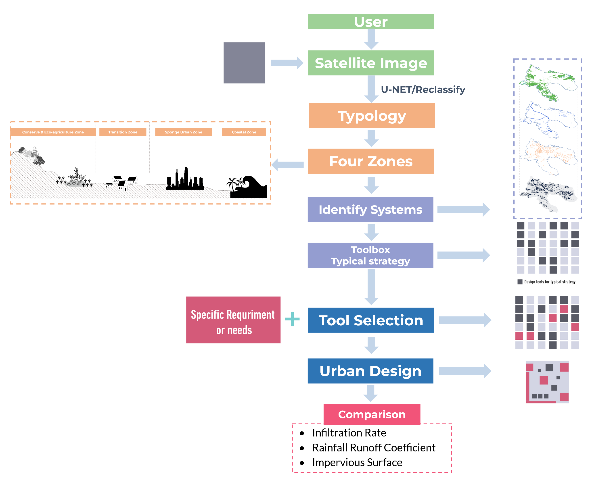

## Portfolio

---

### Data Analytics

[Tai Po: From A Flood-prone Town to A Water-resilient City](https://issuu.com/s7_h/docs/6402_final_recommended_report_s)
  
Nowadays, climate change has become an issue that has to be faced head-on, and society has the responsibility to respond to such issues. This project aims to analyse and enhance the stormwater management capacity in Tai Po while developing a guideline and design toolkit that assists the cooperation between different departments. Through conducting quantitative analysis and questionnaire survey to assess capacities, and training the segmentation model U-Net to enhance the reproducibility of the design toolkit. This was the capstone project for Smart Planning and Design Studio course taught in ArcGIS and Python at HKU in Spring 2022.

- [CLICK HERE TO GO TO THE PROJECT'S REPOSITORY](https://github.com/S7HUANG/URBA6402_Unet)

---
[Analyzing Driving factors of Land Price Based on Big Data in New York](https://raw.githubusercontent.com/S7HUANG/s7huang.github.io/main/pdf/6002_FinalReport.pdf)
  
Studying the influential factors on the land value can help better understand the spatial-temporal variation of land values and design effective control policies. More than 500 potential factors are considered in this project, covering the land attribute, demographics, economics, public safety, transportation, and point of interest, which are further selected using Recursive Feature Elimination. Five machine learning algorithms, including Random Forest, Gradient Boosting Decision Tree, Multi Linear Regression, Multilayer Perceptron Regression, and K-Nearest Neighbour Regression are evaluated and compared. This was the final project for the Urban Big Data Analysis course taught in Python at HKU in Spring 2022.

---
[Evaluating the Environmental Impacts of Urban Sprawl in Xiamen, China](https://raw.githubusercontent.com/S7HUANG/s7huang.github.io/main/pdf/6003_FinalReport.pdf)
  
How cities develop in the years to come will determine progress in addressing key environmental, economic and social challenges. This project analyses the impact of urban sprawl on the ecological environment in Xiamen city to provide insights for future development. The GIS spatial analysis method and the RSEI remote sensing ecological model are used as technical tools to restore and analyze the urban and ecological environment of Xiamen and to explore the relationship between the continuous urban expansion and ecological environment changes. This was the final project for the Programming and AI for Future Cities course taught in Python at HKU in Spring 2022.

---
[London Air Quality Report](https://raw.githubusercontent.com/S7HUANG/s7huang.github.io/main/pdf/6001_FinalReport.pdf)
  
Lockdown measures to contain the COVID-19 pandemic have resulted in a considerable change in air pollution worldwide. This project attempts to discuss to what extent the changes in air quality can be explained by human mobility during the pandemic. Through the comparison of air pollutant (NO2, O3, PM2.5, PM10) concentrations in 2020 with those in 2005–2019 and 2021 respectively. And further detecting the relationships between air quality and human mobility changes, with statistical and spatial analysis. This was the final project for the Foundations in Spatial Data Analysis course taught in Python at HKU in Fall 2021.

---
[Kwun Tong: The Livable Neighborhood](https://raw.githubusercontent.com/S7HUANG/s7huang.github.io/main/pdf/6008_FinalReport.pdf)
  
In the Vision 2030+ plan, Kwun Tong is shaped to be the CBD2, a new business hub after Central. Therefore, this project aims to investigate the future possibilities of Kwun Tong by studying three scenarios: to understand Kwun Tong position as a CBD in Hong Kong when compared with CBD 1 and CBD 3, to address the connectivity issues, and to improve Kwun Tong as a better community by studying GIC allocation. This was the final project for the Spatial Planning Analytics course at HKU in Fall 2021.

---

### Writing and Design Samples

- [DRAFT Policy Memo: Recidivism Algorithm for Statewide Prison to Employment Iniative in Oakland, CA](/pdf/MUSA508_HW5_KristinChang.pdf)
- [DRAFT Policy Memo: Policy Recommendations for Crime Mapping in Oakland, CA](/pdf/CPLN520_FinalProject_KristinChang.pdf)
- [CASE STUDY: Vineyard Wind 1, First U.S. Large-Scale Offshore Wind Project in Massachusetts](/pdf/CCTermPaper1.pdf)

---

---

Page template forked from <a href="https://github.com/evanca/quick-portfolio">evanca</a>

<!-- Remove above link if you don't want to attibute -->
